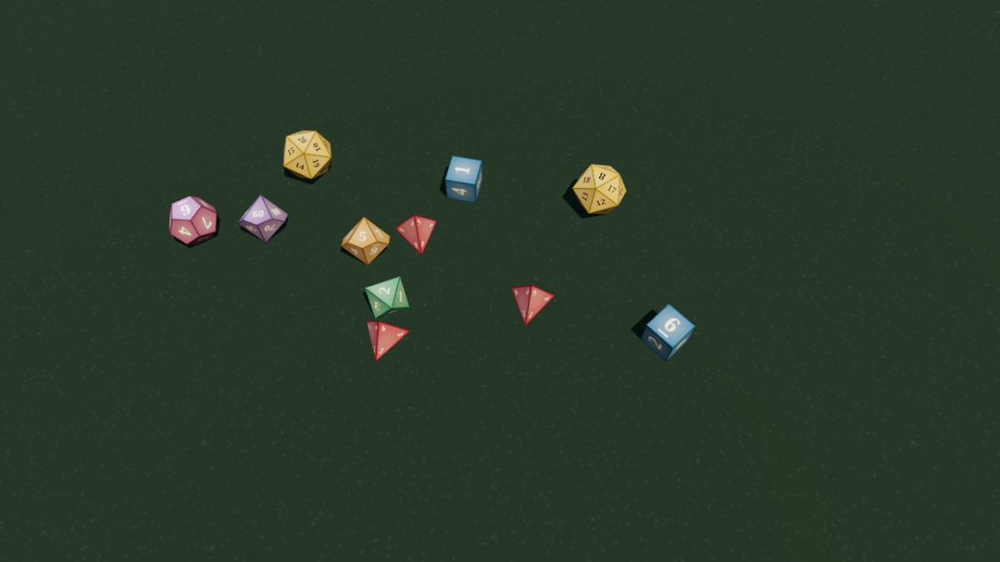

# Dice Table

A 3D physics dice roller for tabletop RPGs. Dice tumble across a felt table
with real physics, settle on real faces, and show their results on screen —
solo, or at a shared multiplayer table with no database and no persistent
state anywhere.



## Features

- **Seven die types** — d4, d6, d8, d10, d10x (percentile 00–90), d12, d20 —
  as true polyhedra (the d10 is a mathematically planar pentagonal
  trapezohedron) simulated with [cannon-es](https://github.com/pmndrs/cannon-es)
  and rendered with [three.js](https://github.com/mrdoob/three).
- **Dice pools** — build a pool (e.g. 3d4, or 1d6 + 1d10), name it, save it,
  and reroll it with one click. Saved pools edit in place: a pencil on the row
  opens name + notation, and Update writes back to the same pool.
- **Pools in the URL** — saved pools are continuously mirrored into the URL
  hash (`#g=<base64url>`). Bookmark the link and your pools are restored on
  any machine, with zero server or account state.
- **Shared tables** — run the bundled server and everyone in a room sees the
  same dice land on the same values, with per-player attribution, a live
  player list, and a shared roll log.
- **Roll meanings** — multi-die totals are read against the *Your Soul Deal*
  outcome chart (Blemish, Mishap, Partial Success, Success & Bonus, Advantage,
  Critical Success, …). Critical Success and Critical Fail get full-screen
  effects.
- **Collapsible chrome** — four independent regions (Compose, Saved pools,
  Players, Roll log), each collapsing to a small labelled edge tab, each
  remembering its own state. Collapse them all (⤡, or `m`) and only the table
  is left — sized for a corner window during a video call. Small windows start
  collapsed. A persistent rail (identity · ⚙ · 🔊 · ❯) never hides.
- Roll log with timestamps, per-die breakdowns, and max/min highlighting;
  procedural impact sounds; solo mode persists pools and log in localStorage.

## Quick start

Multiplayer (recommended — also serves the app):

```bash
node server.js            # PORT=8123 by default
```

Then open `http://localhost:8123/?room=yourparty`. Everyone who opens the same
room shares the table. Rooms are created on demand, live in memory, and vanish
when empty.

Solo / static hosting — serve the directory with any static file server:

```bash
python3 -m http.server 8123
```

With no API available the app detects it and falls back to fully-local play.

## How shared rolls work

The server (zero npm dependencies, in-memory only) assigns each roll's values
with crypto randomness and broadcasts them over Server-Sent Events. Each
client then fast-forwards its own physics simulation headlessly from a shared
seed, records keyframes, and applies a per-die corrective rotation so the die
visually lands on the server's value — then plays the tumble back. Every
client shows identical results without requiring cross-browser floating-point
determinism, and no client is trusted for values.

## Development

No build step. The app is plain ES modules; dependencies are vendored in
[`vendor/`](vendor/README.md) (MIT-licensed; see that file for versions).

Layout:

- `server.js` — room server: static files + `/api/join`, `/api/roll`,
  `/api/clear`, `/api/events` (SSE)
- `js/main.js` — scene, roll engine (simulate-ahead + keyframe playback),
  UI, multiplayer wiring
- `js/dice.js` — die geometry, face textures, physics hulls, value reading
- `js/net.js` — join/SSE/reconnect client
- `js/meanings.js` — the *Your Soul Deal* roll-meaning chart
- `js/urlgroups.js` — saved pools ⇄ URL-hash codec (the `#g=` spelling, and
  the `group` identifiers behind it, are kept for link compatibility)

For automated testing in hidden tabs (where `requestAnimationFrame` never
fires), `window.__diceDebug` exposes `sim(frames)`, `playRoll(roll)` with
forced values, `rollDice`, `clearTable`, and connection state.

## Testing

```bash
npm test                    # unit + fuzz + e2e smoke (seconds)
npm run test:e2e:full       # full end-to-end sweep
```

End-to-end tests drive headless Chrome over raw CDP with zero dependencies
(`tests/e2e/` — Node ≥ 22 and a Chrome/Chromium binary required). Policy in
[docs/TESTING.md](docs/TESTING.md).

## License

Apache License 2.0 — see [LICENSE](LICENSE). Vendored third-party libraries
in `vendor/` remain under their own licenses ([details](vendor/README.md)).
