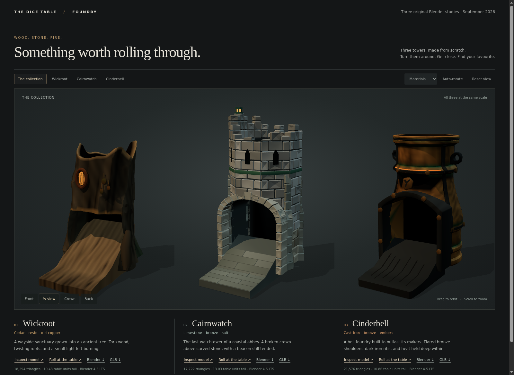

<!-- Copyright 2026 The Dice Table Authors — SPDX-License-Identifier: Apache-2.0 -->

# Foundry review — 11 September 2026

Three new Blender tower studies are complete in the isolated foundry
worktree. Each includes its recipe, editable scene, GLB, a working solo
table preview, and rendered evidence. No existing tower geometry or tower
recipe geometry was used. Shared export, loader and physics utilities are
the integration surface.

| Study | Triangles | Editable mesh objects | In-app meshes | Entry rim | Exit width × height |
| --- | ---: | ---: | ---: | ---: | --- |
| Wickroot | 18,294 | 16 | 6 | 7.70 | 4.20 × 3.375 |
| Cairnwatch | 17,722 | 5 | 6 | 9.10 | 4.35 × 3.70 |
| Cinderbell | 21,576 | 40 | 7 | 9.60 | 4.40 × 3.80 |

Dimensions are app units. All three sills are 1.0. Full bounds, portal
derivations, geometry/color digests, complete GLB SHA-256 hashes, file sizes
and measured pour results are in [build-record.json](build-record.json).

## The visual decisions

**Wickroot** became a shorter sanctuary stump after the first tall forms
read as corrugated pipes. Unequal crown shoulders, irregular bark fields,
faceted root collars, a grain-painted heartwood tongue and hanging copper
tokens carry the final miniature. The doorway and rim were lowered together
and remeasured. The final threshold sliver was an actual mesh protrusion;
compressing its vertex columns below the ramp removed it without collapsing
the small triangles. The final hero, normal view and in-app sheet were
inspected after that correction. The bark remains deliberately stylized;
its broad exit tongue is still the most visibly functional part.

**Cairnwatch** uses full-thickness broken masonry at the crown, stacked
buttresses, a stone arch and jointed threshold. A smooth sloping crown and
thin buttresses were rejected in the first review. Two defective decorative
arch-facing fragments were omitted as whole stones; the intact structural
core remains behind them. The final crown stones are supported and the
beacon has a proper footing. The wear is coarse and faceted, rather than
photorealistic surface erosion.

**Cinderbell** has a pinched neck, lower bell flare, double rolled lip,
pierced lifting eyes, large fasteners and a small maker's mark. The first
arch cut opened unintended rear holes; its depth was shortened and the
rear view checked. Bronze was brightened after inspection in the room,
with oxide concentrated at seams. The forty editable pieces are batched
into seven exported meshes. The low skirt belt stays separate because
combining it with the tall lip made the envelope audit infer a wide crown
that did not exist. Fine bronze wear is subtler under the room lighting
than under the gallery studio lights.

## Verified on the final packaged files

- The main session independently rebaked all three recipes. Geometry and
  colors match the builders' repeat bakes; complete GLB bytes also reproduce.
- Every bake passes watertightness, winding, degenerate-face, vertex-color,
  budget, portal, approach, exit, lane cladding, occlusion and socket checks.
- All three loaded into the actual app with model-authored portals, zero
  unclassified fit overruns, no off-policy materials, and every shaft/cowl
  sample hidden at all six shipped eyes.
- Each final model delivered `1d20`, `1d8+1d6+1d10`, and `8d6`: nine pours,
  all delivered on the first bake attempt, no unseen or stranded dice.
  The completed values stayed visible; removing a tower restored the
  towerless body list. Each model adds exactly eight engine colliders.
- The gallery passed desktop and phone checks, all six asset downloads,
  hero/crown/normal views, and the actual button opening a new solo table
  with the chosen model. Final screenshots were opened and inspected.
- Each packaged `.blend` was reopened in Blender and checked for meshes,
  licensing metadata, and a framed material-preview starting view.
- `npm test` passed, including all 60 e2e smoke scenarios. The static-cache
  check also passed after excluding the study directory from deployment.

Evidence is retained in [previews/](previews/): the gallery, normal sheet,
individual hero/crown views, six-view app sheets, and mid-pour screenshots.

## Scope and guidance departures

The 15k triangle guidance was increased for these art studies to preserve
broken masonry, organic surface shapes and cast-metal details. The measured
totals above remain under the chosen 22k prototype ceiling. No GOALPOST
promise was set aside.

These are completed model studies, not permanent catalogue additions.
Production registration, family pairing, distinct final sound palettes,
shared-room distribution and a full release sweep are outside this pass.
Existing sound shapes are temporary preview plumbing. The study directory
is excluded from Cloud Build uploads.

The trial tooling uses a solo lobby intentionally: new IDs cannot pass the
room server's fixed tower allowlist. It serves models from `models/` because
the app server does not serve raw `tools/forge/out/` paths. No server or
production-registry changes were needed, and port 8123 was never used.
